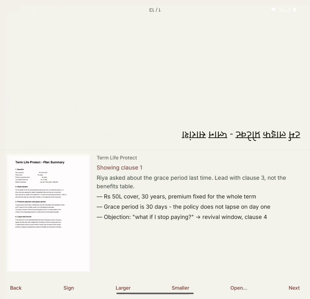

# Twofold

**One device. Two sides of the table.**

**[twofold site →](https://amritha902.github.io/twofold/)** · **[watch the demo →](https://amritha902.github.io/twofold/media/twofold-demo.mp4)** · [privacy](https://amritha902.github.io/twofold/privacy.html)

Millions of people sign financial documents they cannot read — while the person selling to them
translates aloud, approximately, in their own interest.

Twofold puts a Galaxy foldable flat on the table between the two of them. The crease splits the
screen, and each half shows the form of the document that suits whoever is looking at it.

- **Their half** shows one clause, as text, large enough to read across a table.
- **Your half** shows the whole page as printed, plus your private notes and your talk track.
- Move to a clause and it appears in front of them.
- They sign on their half when you're done.

You never hand over your phone. They never see your notes.

**Why a clause and not the page.** That half of a flat foldable is 130 × 63 mm. An A4 page fitted
into it renders at 20% — a 10pt clause lands on the glass at about 2pt, which is unreadable by
anyone. Measured, not estimated. So the client's half shows extracted text at 13.5pt instead, and
the constraint turns out to make a better product: one clause at a time beats a wall of legalese,
and text can be translated where a page image cannot.

*Held in the hand it's a private editor. Set it down and it becomes two-sided. No button is
pressed — the posture is the command.*

### Watch it

| | |
|---|---|
| **[The demo — 30s](https://amritha902.github.io/twofold/media/twofold-demo.mp4)** | The full flow: prepare, set it down, point at a clause, ask for a signature, the client signs, the signed copy is exported. |
| [Just the hook — 11s](https://amritha902.github.io/twofold/media/twofold-hook.mp4) | The transition on its own. No narration; it doesn't need any. |

Both were recorded on a folding device. Nothing is mocked up.

---

## Why this needs a foldable

Not "works better on" — **cannot exist otherwise**. A conventional phone has one screen facing one
direction. To show a document to the person across the table you either turn the phone around and
read upside-down, hand it over and lose control of it, or carry a laptop.

Twofold uses the crease as a genuine interface boundary: two panes, opposite orientations, one
device, simultaneously. It's the only phone interaction that has a *far side*.

## Who it's for

Field agents who explain documents across tables for a living — insurance, loans, mutual funds. This
is a workflow that happens millions of times a day and currently has no good tool. The alternatives
are a ₹40,000 laptop that doesn't fit on a café table, a printout, or an upside-down phone.

Twofold is content-light on purpose: the agent brings their own PDF. There is no catalogue to
license and no curriculum to author.

## Status

Pre-release. Building for the [RevenueCat Shipaton 2026](https://revenuecat-shipaton-2026.devpost.com)
"Best App for Galaxy" category. Target ship date: **September 20, 2026**. Submissions close September
30, 2026.

## Docs

| | |
|---|---|
| [Product spec](docs/PRODUCT.md) | What v1 is, what it isn't, and the interaction model |
| [Architecture](docs/ARCHITECTURE.md) | Technical design, foldable APIs, module layout |
| [Design](docs/DESIGN.md) | Visual identity and the rules it follows |
| [Shipaton plan](docs/SHIPATON.md) | Dates, critical path, category strategy |
| [Devpost submission](docs/DEVPOST.md) | The write-up, paste-ready |
| [Store listing](docs/store/LISTING.md) | Galaxy Store copy and assets |
| [Privacy policy](https://amritha902.github.io/twofold/privacy.html) | What leaves the device, and what doesn't |

## License

[GNU AGPL-3.0](LICENSE). You may read, run, modify and share this code; if you run a modified
version as a network service, you must publish your changes under the same licence.

Copyright is held solely by the author, who is therefore not bound by it — commercial and dual
licensing remain available on request.
